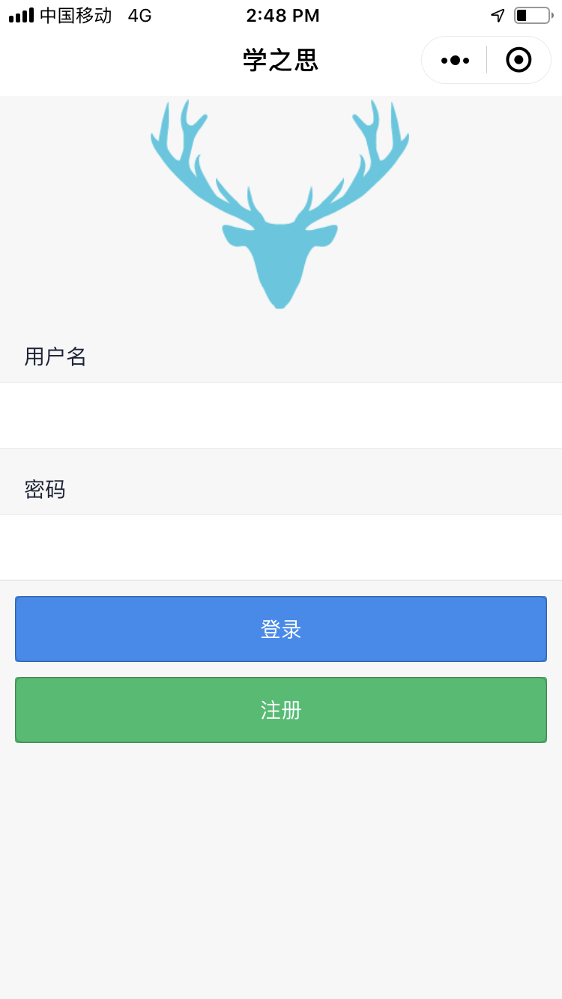
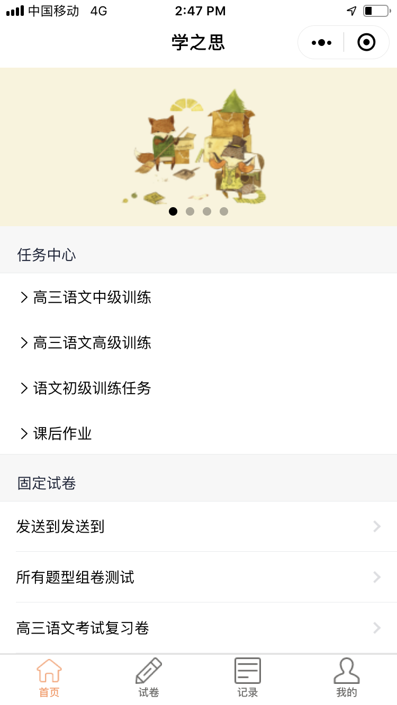
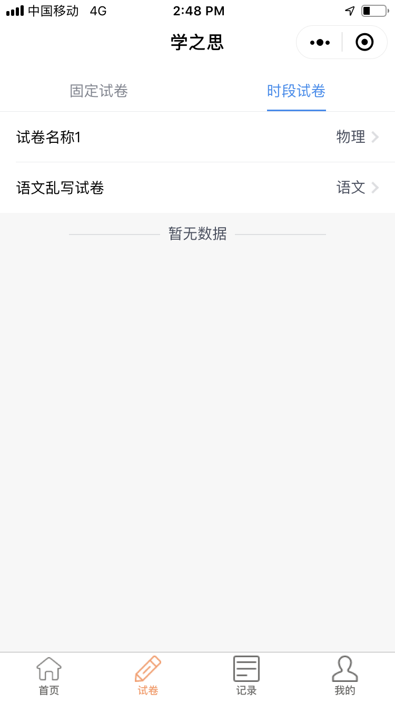
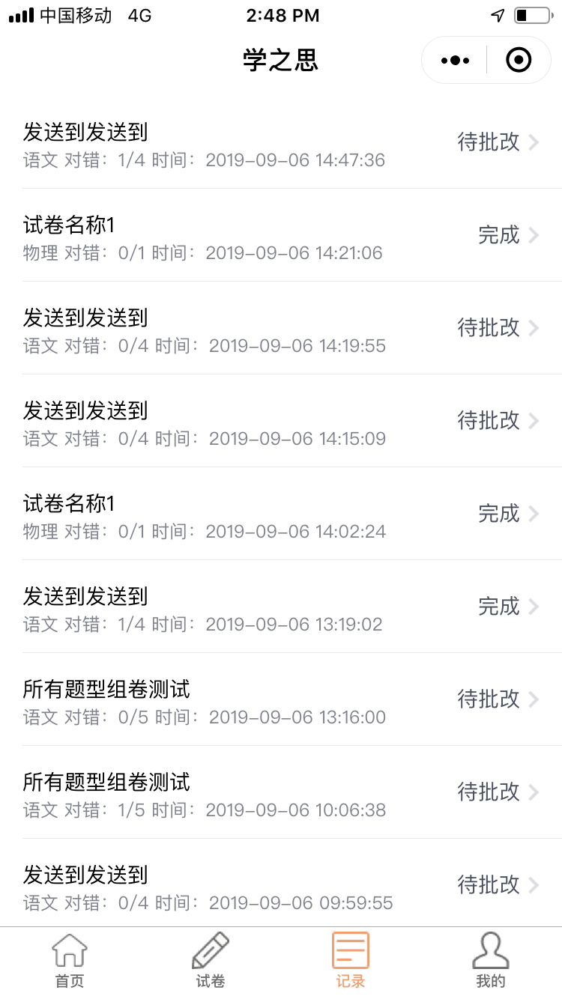
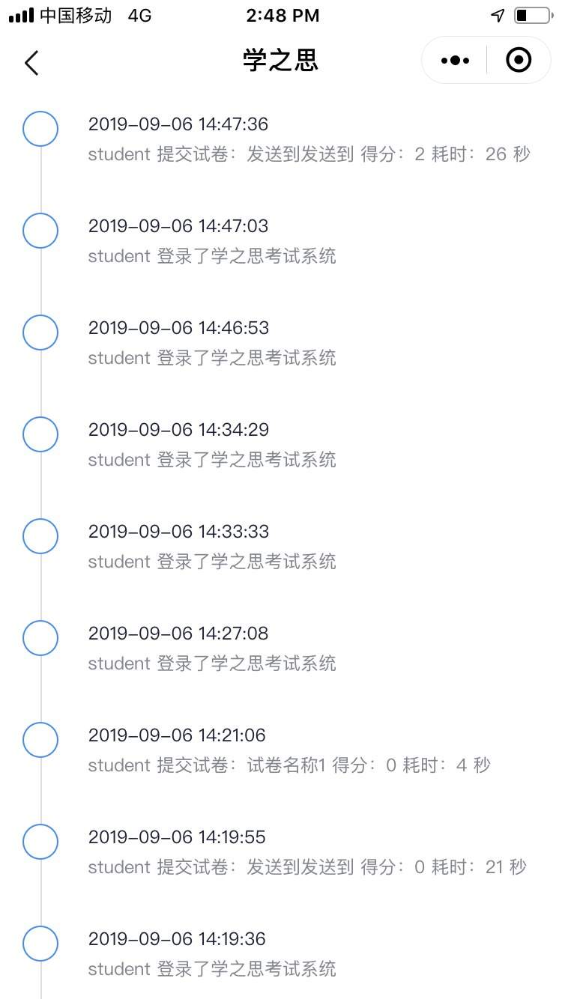
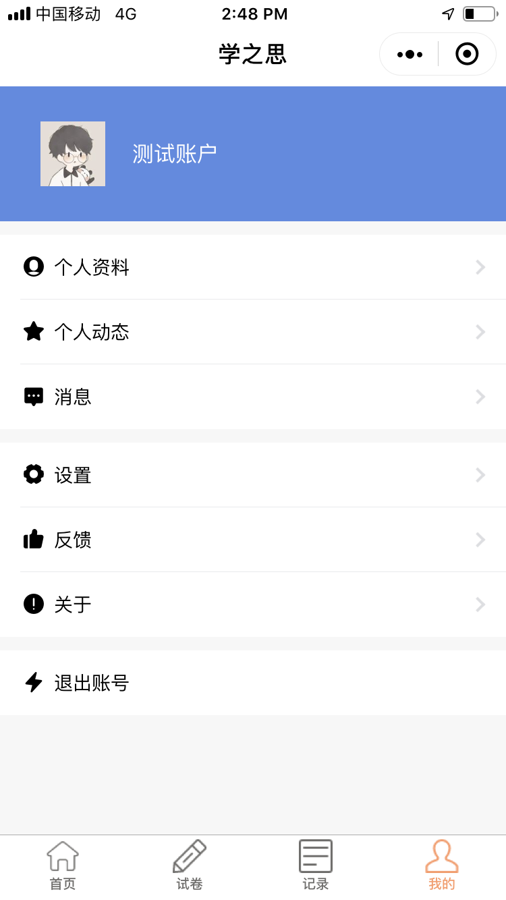

<a href="https://www.mindskip.net" target="_blank">
 
<a/>

# 学之思开源考试系统 - 微信小程序

## 项目介绍

学之思开源考试系统是一款 java + vue 的前后端分离的考试系统。主要优点是开发、部署简单快捷、界面设计友好、代码结构清晰。支持web端和微信小程序，能覆盖到pc机和手机等设备。
支持多种部署方式：集成部署、前后端分离部署、docker部署。

### 演示地址

* 官网：[https://www.mindskip.net](https://www.mindskip.net)
* 学之思开源考试系统：[https://www.mindskip.net/xzs.html](https://www.mindskip.net/xzs.html)
* 维多多培训考试系统：[https://www.mindskip.net/wdd.html](https://www.mindskip.net/wdd.html)
* 思多多智能考试系统：[https://www.mindskip.net/sdd.html](https://www.mindskip.net/sdd.html)

### 学之思交流群(加群获取数据库脚本)

* QQ交流群15：`675037554`
* 商务QQ：`2732007709`
* 商务微信：`mind_skip`
* 商务邮箱：`mindskip@qq.com`

### 学之思仓库版本地址

* gitee：[https://gitee.com/mindskip/xzs-wechat](https://gitee.com/mindskip/xzs-wechat)
* github - postgresql ：[https://github.com/mindskip/xzs-wechat](https://github.com/mindskip/xzs-wechat)

### 开发部署教程

* 文档教程：[https://www.mindskip.net:999](https://www.mindskip.net:999)
* 视频教程：[https://ke.qq.com/course/3614230](https://ke.qq.com/course/3614230)

### 小程序功能

|  模块   | 介绍  |
|  ----  | ----  |
| 登录  | 用户登录登出功能，登录会自动绑定微信账号，登出会解绑  |  
| 注册  | 年级、用户名、密码  |  
| 任务中心  | 管理员发布的年级任务，每个学生只能做一次  |  
| 考试  | 题干支持文本、图片、数学公式、表格等，学生答题支持：文本  |  
| 固定试卷  | 可重复练习、自行批改的试卷  |  
| 时段试卷  | 在时间限制内，可重复练习、自行批改的试卷  |  
| 考试记录  | 查看答卷记录和试卷信息  |  
| 错题本  | 答错题目会自动进入错题本，显示题目基本信息  |  
| 个人信息  | 显示学生个人资料  |  
| 更新信息  | 修改个人资料、头像  |  
| 个人动态  | 显示用户最近的个人动态  |  
| 消息中心  | 用于接收管理员发送的消息  |  

### 系统展示

*  小程序考试系统
<table>
    <tr>
        <td></td>
        <td></td>
        <td></td>
        <td></td>
    </tr>
    <tr>
        <td></td>
        <td></td>
        <td></td>
        <td></td>
    </tr>
</table>
